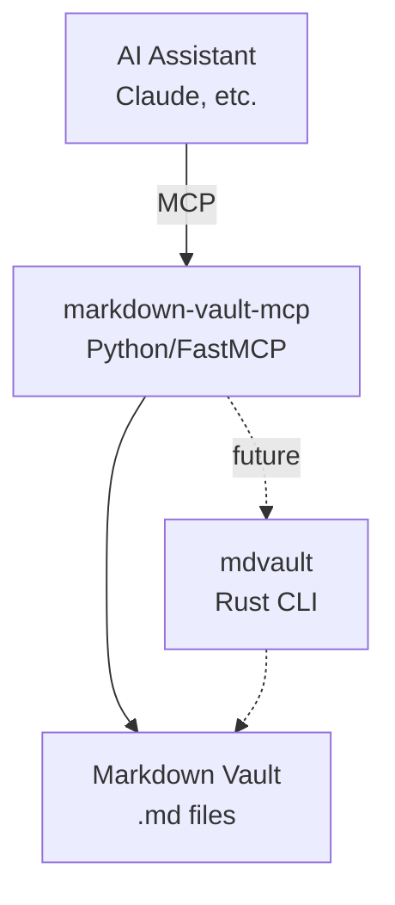

# markdown-vault-mcp

[](https://github.com/agustinvalencia/markdown-vault-mcp/actions/workflows/ci.yml)
[](https://codecov.io/gh/agustinvalencia/markdown-vault-mcp)

**Python MCP server for programmatic access to markdown-based knowledge vaults**

A sister project to [mdvault](https://github.com/agustinvalencia/mdvault), providing AI assistants with seamless access to your markdown vault through the [Model Context Protocol](https://modelcontextprotocol.io/).

## Overview

While **mdvault** provides a Rust CLI and TUI for human interaction with your vault (templates, captures, macros, validation), **markdown-vault-mcp** exposes your vault to AI assistants through MCP. Together, they form a complete toolkit for managing markdown-based knowledge systems.



## Features

- **Browse**: List notes and folders in your vault
- **Read**: Access note content and YAML frontmatter metadata
- **Search**: Find notes by content with contextual results
- **Update**: Modify frontmatter, append content, toggle tasks
- **Navigate**: Explore backlinks, outgoing links, orphans, and related notes

## Installation

Requires Python 3.14+ and [uv](https://docs.astral.sh/uv/).

```bash
git clone https://github.com/agustinvalencia/markdown-vault-mcp.git
cd markdown-vault-mcp
uv sync
```

## Configuration

Set the vault path environment variable:

```bash
export MARKDOWN_VAULT_PATH="/path/to/your/vault"
```

### Claude Desktop

Add to your Claude Desktop configuration (`~/Library/Application Support/Claude/claude_desktop_config.json`):

```json
{
  "mcpServers": {
    "markdown-vault": {
      "command": "uv",
      "args": ["run", "--directory", "/path/to/markdown-vault-mcp", "python", "-m", "mdvault_mcp_server"],
      "env": {
        "MARKDOWN_VAULT_PATH": "/path/to/your/vault"
      }
    }
  }
}
```

### Claude Code

Add to your Claude Code MCP settings:

```bash
claude mcp add markdown-vault -- uv run --directory /path/to/markdown-vault-mcp python -m mdvault_mcp_server
```

## Available Tools

| Tool | Description |
|------|-------------|
| `list_notes` | List markdown notes in a folder |
| `list_folders` | List subfolders |
| `read_note` | Read full note content |
| `read_note_excerpt` | Read note with line limit |
| `get_metadata` | Get frontmatter as JSON |
| `search_notes` | Find notes containing text |
| `search_notes_with_context` | Search with surrounding context |
| `update_metadata` | Update frontmatter fields |
| `append_to_note` | Append content to a note |
| `update_task_status` | Toggle task checkboxes |
| `find_backlinks` | Find notes linking to a note |
| `find_outgoing_links` | Find notes a note links to |
| `find_orphan_notes` | Find notes with no links |
| `suggest_related_notes` | Suggest notes by shared links |

See [docs/tools.md](docs/tools.md) for detailed documentation of each tool.

## Usage Examples

Once configured, your AI assistant can interact with your vault:

> "What notes do I have about Python?"

```
I'll search your vault for Python-related notes.

Found 5 notes mentioning Python:
- concepts/python.md
- projects/learning-plan.md
- daily/2024-01-15.md
...
```

> "Show me what links to my programming concepts note"

```
Looking for backlinks to concepts/programming.md...

3 notes link to this:
- concepts/python.md
- concepts/rust.md
- projects/learning-plan.md
```

> "Mark the 'Review PR' task as complete in today's daily note"

```
Updated daily/2024-01-20.md:
- [x] Review PR comments
```

## Development

```bash
# Install dependencies
uv sync

# Run the server (for testing)
MARKDOWN_VAULT_PATH=/path/to/vault uv run python -m mdvault_mcp_server

# Run with debug logging
MARKDOWN_VAULT_MCP_DEBUG=true uv run python -m mdvault_mcp_server

# Lint
uv run ruff check src/

# Format
uv run ruff format src/
```

## Relationship with mdvault

| Feature | mdvault (Rust) | markdown-vault-mcp (Python) |
|---------|----------------|----------------------------|
| **Purpose** | Human CLI/TUI interaction | AI assistant integration |
| **Templates** | Yes | Planned (via mdvault CLI) |
| **Captures** | Yes | Planned (via mdvault CLI) |
| **Macros** | Yes | Planned (via mdvault CLI) |
| **Reading** | Via CLI commands | MCP tools |
| **Search** | SQLite index | Direct file search |
| **Link Graph** | SQLite index | Real-time parsing |
| **Validation** | Type schemas | - |

Future versions will integrate with mdvault's template and capture system, allowing AI assistants to create structured notes using your defined templates.

## License

MIT License - see [LICENSE](LICENSE) for details.
